class: center,  middle, hide_logo


<head>
<script src="https://kit.fontawesome.com/994a28441d.js" crossorigin="anonymous"></script>
</head>

<!--<div class="my-footer"><span>Folien CC-BY verfügbar unter https://atelier-phka-merk-2020.netlify.app</span></div> 


<style>
.remark-slide-number {
  font-size: 10pt;
  margin-bottom: -11.6px;
  margin-right: 10px;
  color: red; /* white */
  opacity: 0; /* default: 0.5 */
}
</style>
--> 

```{r xaringan-themer, echo=F, warning=FALSE}
library(xaringanthemer)
library(fontawesome)
library(xaringanExtra)

extra_css <- list(
  ".cit"  = list("font-size" = "70%",
                 "color" = "#6AEE3E90"),
  ".em05" = list("font-size" ="0.5em"),
  ".em06" = list("font-size" ="0.6em"),
  ".em07" = list("font-size" ="0.7em"),
  ".em08" = list("font-size" ="0.8em"),
  ".em09" = list("font-size" ="0.9em"),
  ".em11" = list("font-size" ="1.1em"),
  ".em12" = list("font-size" ="1.2em"),
  ".em13" = list("font-size" ="1.3em"),
  ".em14" = list("font-size" ="1.4em"),
  ".em15" = list("font-size" ="1.5em"),
  ".em16" = list("font-size" ="1.6em"),
  ".em17" = list("font-size" ="1.7em"),
  ".em18" = list("font-size" ="1.8em"),
  ".em19" = list("font-size" ="1.9em"),
  ".bold" = list("font-weight" = "bold"),
  ".large" = list("font-size" = "160%"),
  ".vertmiddle" = list("vertical-align" ="middle"),
  #".lh15" = list("line-height" =  "1.5"),
  ".li" = list("line-height" =  "1.5",
               "font-size" = "160%",
               "font-weight" = "bold"),
  ".phgreen" = list("color" = "#50B32E"),
  ".phgreenlight" = list("color" = "#62DC3A"),
  ".pgl" = list("color" = "#62DC3A"),
  ".phg" = list("color" = "#8cd000"),
 # ".my-footer" = list("background-color" = "#1a1917",
 #                     "position" = "absolute",
 #                     "bottom" = "0px",
 #                     "left" = "0px",
 #                     "height" = "20px",
 #                     "width" = "100%"),
  ".my-footer span" = list("font-size" = "10pt", 
                           "color" = "#F7F8FA",
                           "position" = "absolute",
                           "left" = "15px",
                           "bottom" = "2px"),
  ".remark-slide-number" = list("bottom" = "-18px"),
  ".li" = list("line-height" =  "4"),
  ".scroll-box-18" = list("height" ="18em",
                           "overflow-y" = "scroll"),
  ".scroll-box-23" = list("height" ="23em",
                           "overflow-y" = "scroll"),
  ".hscroll-box-30" = list("width" ="23em",
                           "overflow-x" = "scroll"))

style_mono_accent_inverse(
  base_color = "#8cd000",
  white_color = "#FFFFFF",
  black_color = "#272822",
  extra_css = extra_css)

library(xaringanExtra)
use_logo(
  image_url = "https://apps.samuel-merk.de/data/PHK_2018_Logo_V1_FARBE_NUR_PH.svg",
  width = "80px",
  position = xaringanExtra::css_position(top = "1em", right = "1em")
)
```


.phg[
# Vorlesung:

<i class="fas fa-microscope fa-7x"></i>

### Qualitative und quantitative Forschungsmethoden
---  
.em14[Samuel Merk | PH Karlsruhe]]  
`r typedjs::typed(c("Hallo und 💚-lich Willkommen!", "Die heutige Sitzung wird drei Teile haben:", "1. als erstes werden wir Abstracts lesen und kategorisieren", "2. danach auf das Experiment eingehen, das Sie bearbeitet haben", "und 3. Ihre dann noch offenen Fragen bearbeiten"), typeSpeed = 80, backSpeed = 10, backDelay = 3000, loop = T, contentType = "html")` 


---
class: middle center
## 1) Anwenden der Begriffe auf echte Forschungsliteratur

---
## Einführendes Beispiel: https://bit.ly/merk021
<center>
<iframe id="frame01" src='https://www.spiegel.de/panorama/bildung/neue-studie-lehramtsstudium-ohne-digitalkompetenz-kein-problem-a-417132e4-ff30-4134-8bbb-a14f09599414'></iframe>
</center>
<style>
#frame01{ height: 480px; width: 1000px; align: center; overflow: scroll;}
</style>

---
## Vertiefende Beispiele

Bitte beantworten Sie die Frage auf https://bit.ly/merk006 <br><br>
```{r, out.width="30%", fig.align='center', echo = F, message = F}
library(qrencoder)
par(mar=c(0,0,0,0))
image(qrencode_raster("https://bit.ly/merk006"), 
      asp=1, col=c("#000000", "#62DC3A"), axes=FALSE, 
      xlab="", ylab="", bg = 'transparent')
```

---
class: middle center
# 2) »Heatmap-Experiment«

---
---
class: hide_logo
## Digitales Formatives Assessment
### Ausgangslage
.em13[
* Feedback gilt als vergleichweise stark lernförderliche Intervention .cit[(Black & Wiliam, 2009)]
* Formatives Assessment wird jedoch kaum von Lehrkräften um gesetzt .cit[(Maier, 2019)]
* Digitalen Technologien wird Potential zugeschrieben, die Hürden für formatives Assessment zu senken .cit[(Tomasik et al., 2018)]]
--
.pull-left[
.center[
&nbsp;<br>
#### Sowohl Substitution...
`r fontawesome::fa("file-alt", fill = "#62DC3A", height = "100px")` &nbsp; &nbsp; &nbsp;&nbsp; &nbsp;
`r fontawesome::fa("arrow-right", fill = "#62DC3A", height = "100px")` &nbsp; &nbsp;&nbsp; &nbsp;&nbsp; &nbsp;
`r fontawesome::fa("tablet-alt", fill = "#62DC3A", height = "100px")` 
]
]
.pull-right[
.center[
&nbsp;<br>
#### ... als auch Transformation
```{r, echo = F, fig.cap="molview.org", out.width="35%"}
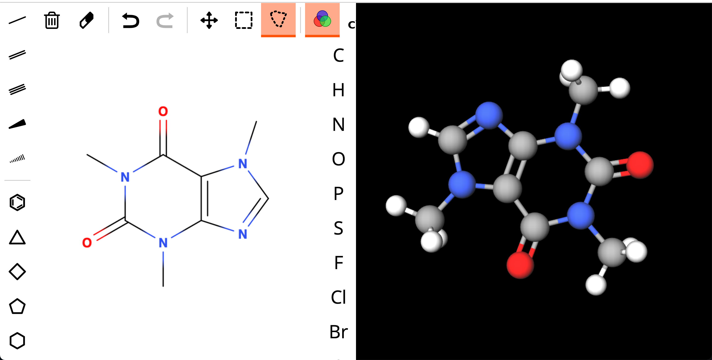
```
]
]

---
class: middle, center

```{r, echo = F, fig.cap="Projektablauf: »Vom Testergebnis zur pädagogischen Maßnahme« (Biaesch Stiftung"}
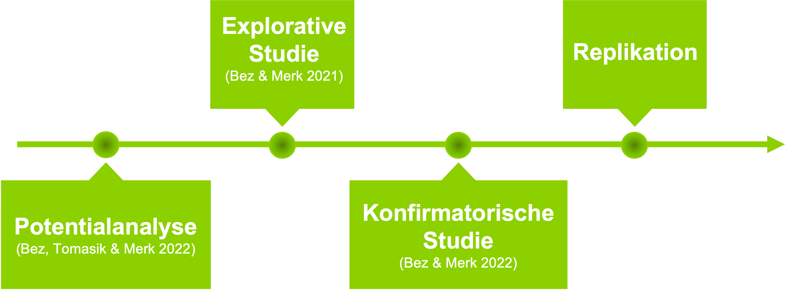
```

---
class: middle, center

```{r, echo = F, fig.cap="Projektablauf: »Vom Testergebnis zur pädagogischen Maßnahme« (Biaesch Stiftung"}
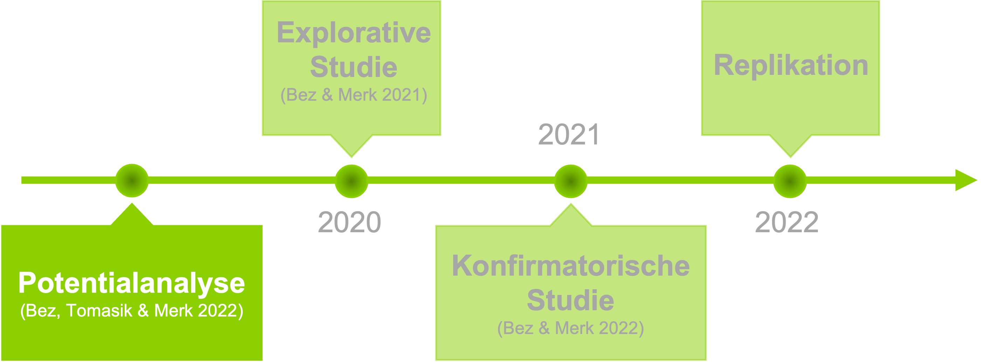
```


---
class: hide_logo
## Potentiale dig. Technologien für die Aufgabenkultur .cit[(Bez, Merk & Tomasik 2021)]
.em14[
* Redefinierte Aufgabenformen 
* Automatisierte Korrektur und unmittelbares Feedback (auch jenseits geschlossener Aufgabenformate)
* Digitale »Aufgabenpools«
    * Interaktive Suche entlang diverser Kriterien
    * Kalibrierte Aufgabenschwierigkeit
* Adaptive Aufgabenauswahl
* Echtzeitergebnisübersicht
* ...]

--

.large[.center[.phg[
$\Rightarrow$ Neue, komplexe Anforderungen an das professionelle Handeln
]]]

---
class: middle, center

```{r, echo = F, fig.cap="Projektablauf: »Vom Testergebnis zur pädagogischen Maßnahme« (Biaesch Stiftung"}
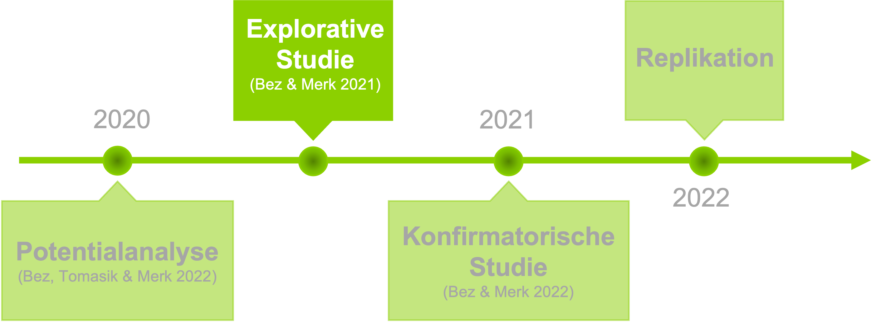
```

---
## Explorative Think-Aloud-Studie
.pull-left[
### Formatives Assessmentsystem
```{r, echo = F, fig.cap="mindsteps.ch", out.width="80%", fig.align='center'}
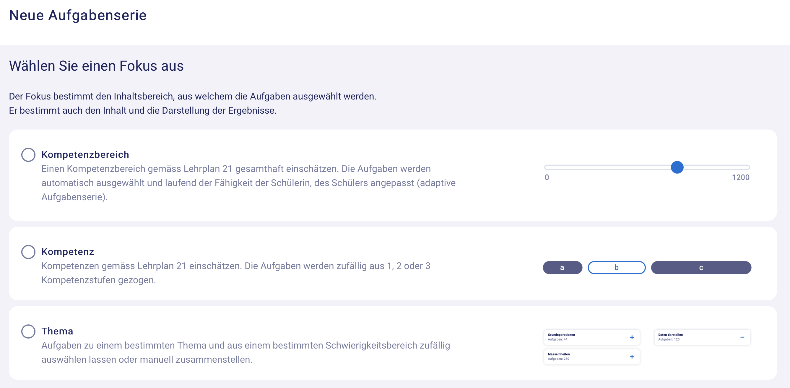
```
]

.pull-right[
### Stichprobe:
* Theoretisches/gezieltes Sampling (Patton 1990)
* $N = 48$ Intensivnutzer\*innen von Mindsteps 
* $N_{weiblich} = 23$
* $MW_{Alter} = 43.7$
* $SD_{Alter} = 11.5$)
]

---
class: hide_logo middle

```{r, echo = F, fig.cap="mindsteps.ch", out.width="71%", fig.align='center'}
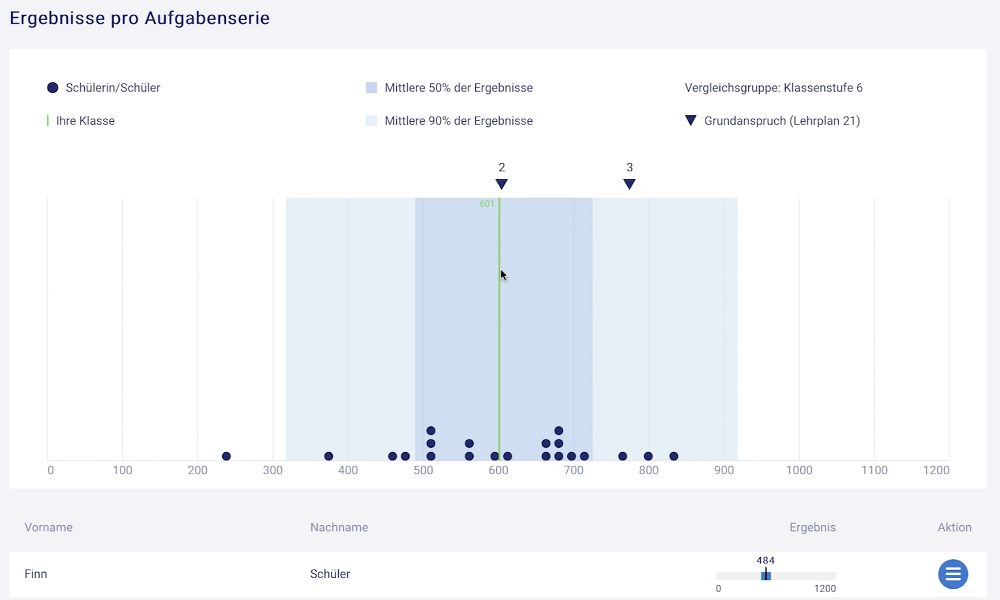
```


---
class: hide_logo middle

```{r, echo = F, fig.cap="mindsteps.ch", out.width="60%", fig.align='center'}
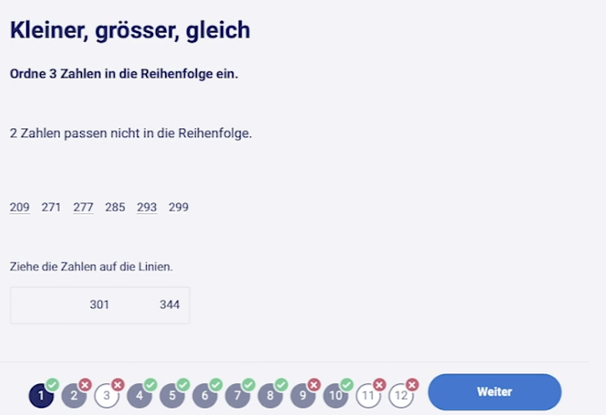
```


---
## Auswertung
Induktiv-Deduktives Timed-Event Coding der Screencasts entlang eines Modells von Coburn & Turner .cit[(2011)]

.pull-left[
1. <b>Noticing</b>
    * Rezeption der Grafiken
        * *Verteilungsform*
        * *Zentrale Tendenz*
        * *Dispersion*
        * *Einzelne Schülerinnen und Schüler*
2. <b>Interpreting</b>
    * Abgleich mit der eigenen Einschätzung
    * Fehleranalyse
        * *Curriculare Subcomponenten*
        * *Aufgabenformatartefakte*
3. <b>Constructing Implications</b>
    * Curriculare Adaoption
    * Einzelförderung
    * Gruppeneinteilung
]

--

.pull-right[
### Interraterreliabilität
* Krippendorffs $.51 ≤ \alpha ≤ .95$ .cit[(Hayes & Krippendorff, 2007)]
* Überführung von Abweichungen in Konsensurteile

### Verlaufsanalyse
* Zero-/First-Order (manifest) Marcov Chains .cit[(Scholz, 2016)]
    * Auszählung (bedingter) relativer Übergangswahrscheinlichkeiten
]

---

### .phgreenlight[Hypothese: Fehleranalyse ist zentral] .cit[(Bez & Merk, 2021)]

```{r, echo=FALSE}
library(visNetwork)
library(readxl)
nodes <- data.frame(id = 1:6, 
                    group = c("Login", "Fehleranalyse", "Abgleich", "Handlungsmaßnahme", "Rezeption der Ergebnisse", "Logout"),
                    label = rep("", 6))
edges <- read_excel("edges_markov.xlsx") %>% 
  dplyr::filter(as.numeric(label) > .07)

mc_rezeption <- 
visNetwork(nodes, edges, width = "1028px", height = "407px",
           background = "black") %>%
  visGroups(groupname = "Login", shape = "icon", 
            icon = list(code = "f04b", color = "#62DC3A", size = 35),
            font = list(color = "#62DC3A", size = 20, strokeWidth = 1, strokeColor = "#62DC3A")) %>%
  visGroups(groupname = "Fehleranalyse", shape = "icon", 
            icon = list(code = "f1e2", color = "#62DC3A", size = 35),
            font = list(color = "#62DC3A", size = 20, strokeWidth = 1, strokeColor = "#62DC3A")) %>%
  visGroups(groupname = "Abgleich", shape = "icon", 
            icon = list(code = "f0c1", color = "#62DC3A", size = 35),
            font = list(color = "#62DC3A", size = 20, strokeWidth = 1, strokeColor = "#62DC3A")) %>%
  visGroups(groupname = "Handlungsmaßnahme", shape = "icon", 
            icon = list(code = "f277", color = "#62DC3A", size = 35),
            font = list(color = "#62DC3A", size = 20, strokeWidth = 1, strokeColor = "#62DC3A")) %>%
  visGroups(groupname = "Rezeption der Ergebnisse", shape = "icon", 
            icon = list(code = "f080", color = "#62DC3A", size = 35),
             font = list(color = "#62DC3A", size = 20, strokeWidth = 1, strokeColor = "#62DC3A")) %>%
  visGroups(groupname = "Logout", shape = "icon", 
            icon = list(code = "f04d", color = "#62DC3A", size = 30),
            font = list(color = "#62DC3A", size = 20, strokeWidth = 1, strokeColor = "#62DC3A")) %>%
  visOptions(highlightNearest = list(enabled =TRUE, degree = 0)) %>% 
  visLegend(width = .3, zoom = F) %>%
  visLayout(randomSeed = 423) %>% # 364 bei filter .15  #25235 bei filter.0
  visPhysics(solver = "repulsion") %>% 
  visEdges(color = list(),
           font = list(color = "#8cd000",
                       size = 16,
                       strokeWidth = 0,
                       strokeColor = "white",
                       vadjust = 10)) %>% 
  addFontAwesome()

widgetframe::frameWidget(mc_rezeption, height = 500)
```

---
class: middle, center

```{r, echo = F, fig.cap="Projektablauf: »Vom Testergebnis zur pädagogischen Maßnahme« (Biaesch Stiftung"}
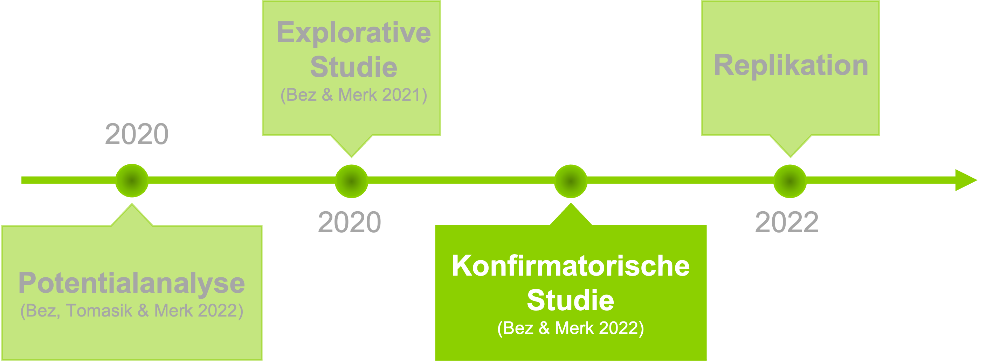
```


---
## Konfirmatorische Studie (RCT)
> .phgreenlight[Ziel: Verbesserung von Noticing und Interpreting durch innovative Darstellungen und eine Kurzzeit-Schulung]

### Abhängige Variablen:

AV1: Akkuratheit
* Wie gut stimmen von Lehrkräften gebildete homogene (Lern-)Gruppen mit algorithmischen Lösungen überein?
        
AV2: Effektivität
* Wie lange brauchen Lehrkräfte um auf ihre korrekte Lösung zu kommen?

AV3: Diagnostische Differenziertheit
* Erkennen Lehrkräfte 
    * Curriculare Subkomponenten und
    * Aufgabenformatartefakte?

---
## Konfirmatorische Studie: Design


---
## Konfirmatorische Studie (RCT)
### Design
```{r, echo = F, out.width="70%"}
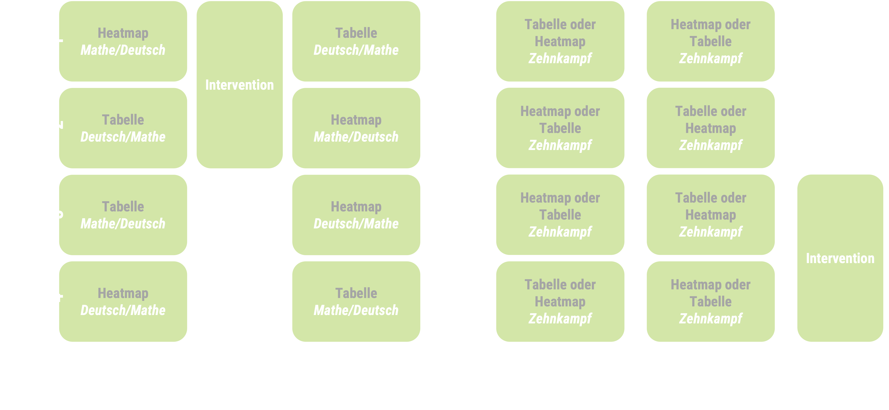
```

---
## Konfirmatorische Studie (RCT)
### Materials
.pull-left[

```{r, echo = F, out.width="90%", fig.align='center', message = F, warning = F, fig.retina=5, fig.height=5, fig.width=8}
library(dplyr)
library(gplots)
library(viridis)
data_dummy_tsheatmap <- read_excel("MWE_Data_1_von Sarah.xlsx")
data_heatmap <- data_dummy_tsheatmap%>%
  select(-PID)%>%
  sample_frac(size = 1)%>%
  as.matrix(., rownames.force = T)

row.names(data_heatmap) <- pull(data_dummy_tsheatmap, "PID")
data_rowmeans <- rowMeans(data_heatmap)
data_colmeans <- colMeans(data_heatmap)

cols <- viridis(100)
rowcols <- viridis(100)
colcols <- viridis(100)
par(bg = 'black', col = "white", axis = "white", col.axis = "white")
heatmap.2(data_heatmap, scale = "none", col = viridis, 
          Rowv = T,
          Colv = T,
          dendrogram = "none",
          trace = "none", density.info = "none",
          RowSideColors = rowcols[round(data_rowmeans*100,0)],
          ColSideColors = colcols[round(data_colmeans*100,0)],
          key.title = NA,
          key.xlab = "Anteil korrekter Lösungen\npro Aufgabe/SchuelerIn",
          key.par = list(cex=.7),
          margins = c(8, 8))#,
          #distfun = function(c) as.dist(1 - c))


```
]

.pull-right[

```{r, echo = F, out.width="80%", fig.align='center', message = F}
library(readxl)
library(tidyverse)
library(gplots)
library(RColorBrewer)
library(viridis)
library(reactable)

data_dummy_tsheatmap <- read_excel("MWE_Data_1_von Sarah.xlsx")

options(reactable.theme = reactableTheme(
  color = "hsl(233, 9%, 87%)",
  backgroundColor = "hsl(233, 9%, 19%)",
  borderColor = "hsl(233, 9%, 22%)",
  stripedColor = "hsl(233, 12%, 22%)",
  highlightColor = "hsl(233, 12%, 24%)",
  inputStyle = list(backgroundColor = "hsl(233, 9%, 25%)"),
  selectStyle = list(backgroundColor = "hsl(233, 9%, 25%)"),
  pageButtonHoverStyle = list(backgroundColor = "hsl(233, 9%, 25%)"),
  pageButtonActiveStyle = list(backgroundColor = "hsl(233, 9%, 28%)")
))

reactable(
  data_dummy_tsheatmap,
  columns = list(
    PID = colDef(minWidth = 150)),
  resizable = TRUE,
  wrap = FALSE,
  showPageSizeOptions = TRUE,
  striped = TRUE,
  highlight = TRUE,
  defaultPageSize = 6
)
```
]

---
## Konfirmatorische Studie (RCT)
### Stichprobe


---
## Konfirmatorische Studie (RCT)
### Ergebnisse: Akkuratheit
.pull-left[
```{r, echo = F, out.width="100%"}
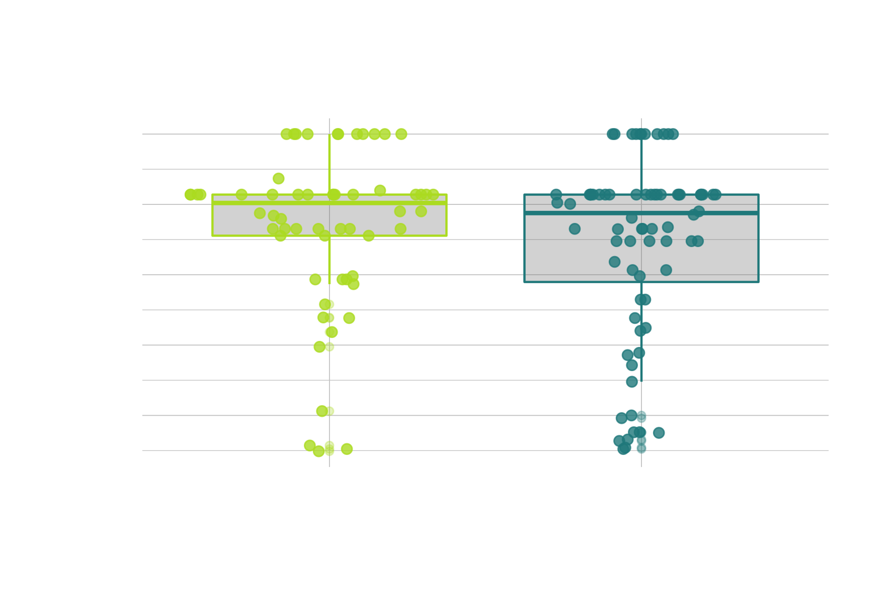
```
]

.pull-right[
```{r, echo = F, out.width="100%"}
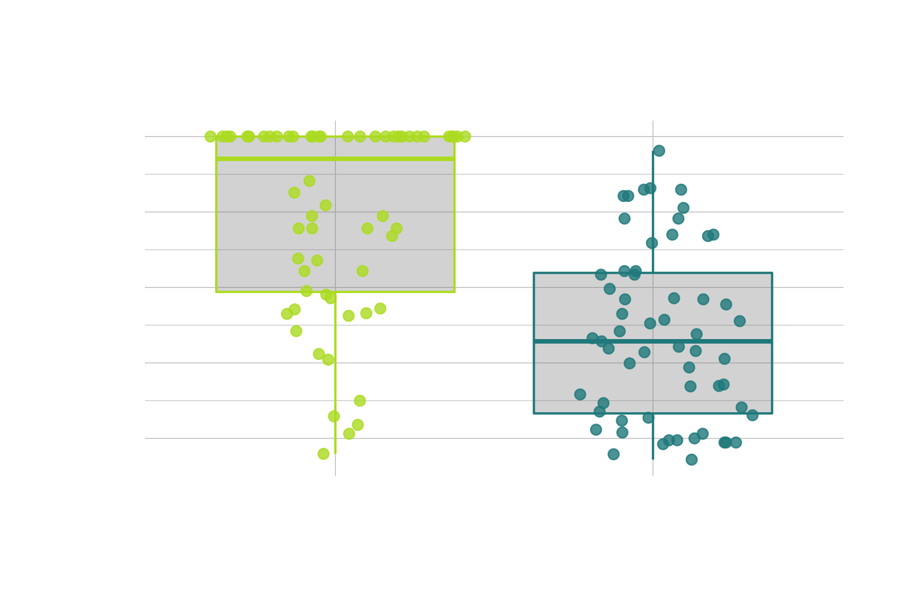
```
]

---
## Konfirmatorische Studie (RCT)
### Ergebnisse: Effizienz
.pull-left[
```{r, echo = F, out.width="100%"}
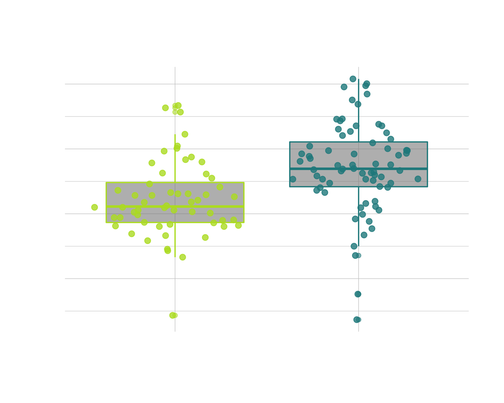
```
]

.pull-right[
```{r, echo = F, out.width="100%"}
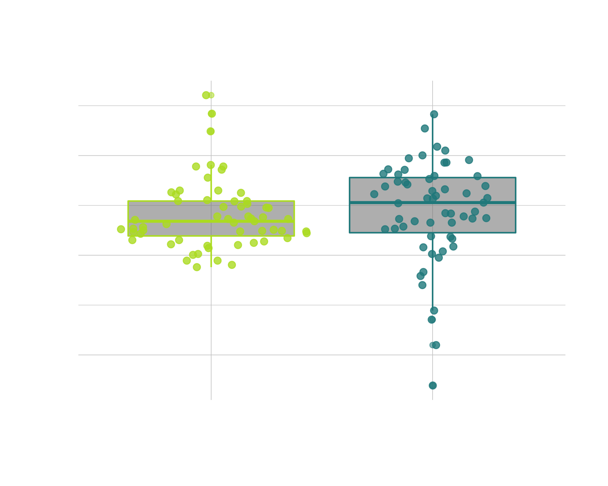
```
]


---
class: middle center
## 3) Ihre Fragen zu Video & Aufgaben

---
## Ihre Fragen zu Video & Aufgaben

Bitte stellen Sie unter https://bit.ly/merk006 Fragen zu Video und Aufgaben.<br><br>
```{r, out.width="30%", fig.align='center', echo = F, message = F}
library(qrencoder)
par(mar=c(0,0,0,0))
image(qrencode_raster("https://bit.ly/merk006"), 
      asp=1, col=c("#000000", "#62DC3A"), axes=FALSE, 
      xlab="", ylab="", bg = 'transparent')
```
